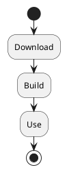

---

title: "Doc As Code: диаграммы PlantUML в Doxygen"
tagline: "Включаем поддержку UML-диаграмм в Doxygen и размышляем о последствиях"
date: 2026-04-13 19:00:12 -0000
tags:
    - documentation
    - doxygen
    - uml
    - markdown
    - vscode
header:
    overlay_image: /assets/images/doxygen-plantuml/doxygen_plantuml_md_result.png
    overlay_filter: rgba(0, 0, 0, 0.8)

---

Ранее я уже [рассказывал про использование Doxygen в связке с Markdown](https://mediocre-developer.ru/sposob-organizacii-dokumentacii-proekta-c-v-stile-doc-as-code) для генерации насыщенной документации к проекту. В этой статье расширим подход, добавив в документацию визуальные диаграммы на [языке PlantUML](https://plantuml.com/ru/). А в конце порассуждаем о преимуществах Doc As Code в эпоху ИИ.

# Что такое PlantUML

[PlantUML](https://plantuml.com/ru/) - это инструмент, позволяющий создавать визуальные диаграммы с помощью простого текстового описания. В основном он используется для генерации UML-диаграмм, но поддерживает и некоторые другие.


Кстати, о том, что такое UML и зачем он нужен [читайте в одной из прошлых статей](https://mediocre-developer.ru/zachem-nuzhny-uml-diagrammy).

# Подготовка окружения

Допустим, что по итогам [прошлой статьи](https://mediocre-developer.ru/sposob-organizacii-dokumentacii-proekta-c-v-stile-doc-as-code) у вас уже настроен проект C++ с Markdown-документацией.

Для корректной работы генератора PlantUML потребуется Java. Скачайте и установите Java [с официального сайта](https://www.oracle.com/java) (или любым другим удобным способом).

После установки убедитесь, что команда `java` доступна из терминала. В случае проблем, самый простой способ - добавить Java в системную переменную `PATH`.

Далее скачайте свежий `plantuml.jar` с [сайта PlantUML](https://plantuml.com/ru/download) и положите его в рабочую директорию проекта рядом с файлом `Doxygen`.

# Включение PlantUML в Doxygen

Чтобы Doxygen научился обрабатывать блоки PlantUML, достаточно указать путь к JAR-файлу в конфигурации. Найдите в файле `Doxygen` параметр `PLANTUML_JAR_PATH` и укажите там путь к файлу `plantuml.jar`:
```
PLANTUML_JAR_PATH = plantuml.jar
```

Doxygen автоматически вызовет PlantUML для рендеринга всех найденных диаграмм в процессе сборки документации.

# Добавление диаграммы в Markdown

Теперь добавим диаграмму в существующий файл `Getting_Started.md`. Синтаксис PlantUML размещается в стандартные markdown-блоки кода с указанием тега языка `plantuml`:

````md
# Getting started

Just build the Lib!


````

При запуске `doxygen Doxygen` система распознает блок диаграммы PlantUML и автоматически заменит его на изображение диаграммы.

Получится такая UML-диаграмма деятельности, встроенная в сгенерированную документацию:


# Добавление диаграммы в документацию класса

[Документация к Doxygen говорит](https://www.doxygen.nl/manual/commands.html#cmdstartuml), что диаграммы можно встраивать не только в Markdown, но и прямо в документацию классов и функций с помощью тегов `/startuml` и `/enduml`.

Пробуем:
```cpp
/**
 * @brief The Lib class defines a super library object.
 *
 *  \startuml
 *    class Lib
 *    class App
 *    App ..> Lib
 *  \enduml
 */
class Lib
{
public:
  /**
   * @brief Constructor.
   * 
   * @param arg the super argument
   */
  Lib(int arg);
};
```

И тоже получаем UML-диаграмму прямо в классе:


# Преимущества и недостатки

Понятно, что для создания диаграмм можно использовать разные инструменты. Но в инструментах, использующих текстовую нотацию, в частности PlantUML, видятся следующие **преимущества**:

- **Удобное версионирование**. Диаграммы хранятся как текст, что отлично подходит для Git. Получаем ясную историю изменений и привычное код-ревью.

- **Экономия места в репозитории**. Текстовые данные имеют меньший размер по сравнению с растровыми или векторными изображениями.

- **Совместимость с ИИ**. Текстовое представление диаграмм лучше интерпретируется современными системами искусственного интеллекта. Открываются возможности как для контроля архитектуры со стороны ИИ, так и повышения качества генерируемого кода.

**Недостатки**:

- **Нет нативной поддержки PlantUML на GitHub**. Если рисовать диаграммы в растре или векторной графике, мы сможем их просматривать прямо на GitHub. Это удобно. Диаграммы PlantUML мы увидим только как текст. Но есть и хорошая новость: [GitHub поддерживает Mermaid](https://github.blog/developer-skills/github/include-diagrams-markdown-files-mermaid/) - аналог PlantUML.

- **Появляются новые зависимости проекта: PlantUML и Java**. С этим придется мириться.

# Интеграция с Visual Studio Code

Писать диаграммы без визуализации "на лету" не удобно. Для комфортной работы в Visual Studio Code можно использовать [специальное расширение](https://marketplace.visualstudio.com/items?itemName=jebbs.plantuml). Оно позволяет видеть превью диаграммы сразу же при ее написании.


Чтобы расширение заработало, в настройках надо указать адрес сервера рендеринга PlantUML `https://www.plantuml.com/plantuml`.


> **Предупреждение**
>
> Перед указанием официального облачного сервера PlantUML уточните, разрешено ли передавать исходные тексты диаграмм вашего проекта на этот внешний ресурс. В закрытых корпоративных средах потребуется развернуть локальный сервер.

# Вывод

Doc As Code в связке с Doxygen / Markdown / PlantUML позволяет вести комплексную, полностью текстовую документацию. Архитектура и исходный код живут рядом. И если раньше Doc As Code казался подходящим лишь для небольших проектов, то в эпоху развития ИИ и генерации кода все выглядит иначе.

Качество генерируемого кода напрямую зависит от информации, размещенной в контексте языковой модели. Объем контекста все еще значительно ограничен. За редким исключением мы не можем поместить в контекст все наши знания о проекте. Поэтому сохраняется потребность в строгой структурированной архитектуре кода и документации к нему, которая позволит решать задачи точечно, не раздувая контекст модели. Есть ощущение, что именно здесь принцип Doc As Code себя еще проявит.

Репозиторий с примером из статьи: [https://github.com/trots/doc-as-code-example](https://github.com/trots/doc-as-code-example)
